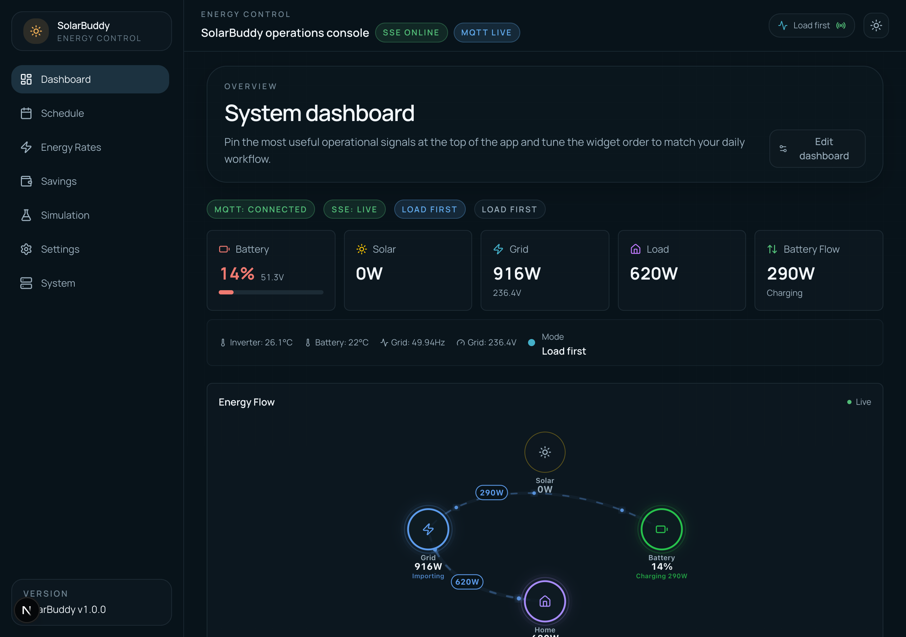
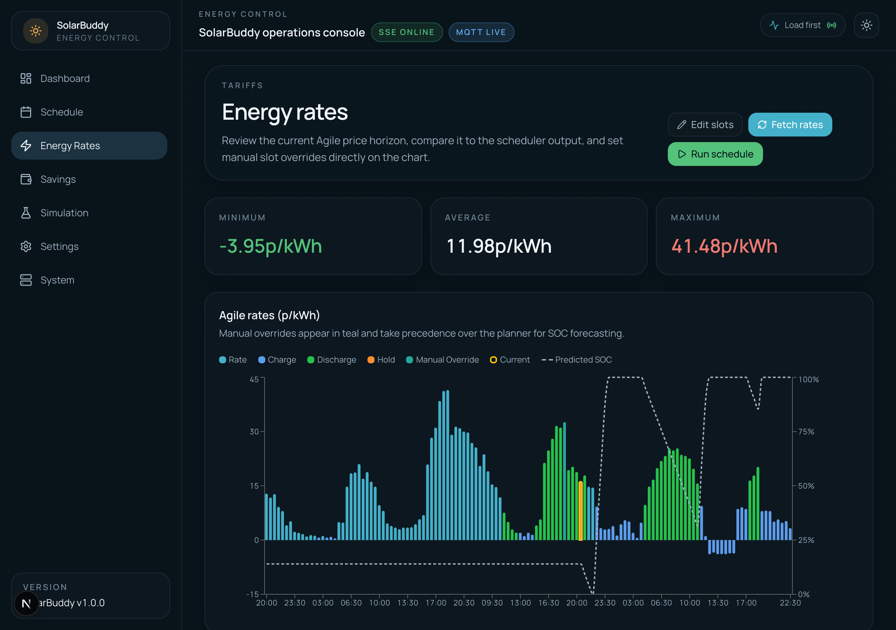
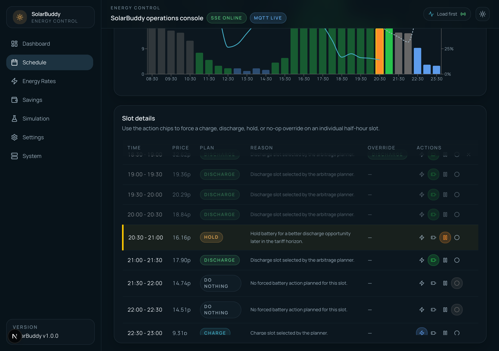

# SolarBuddy

[](https://github.com/jjbrunton/SolarBuddy/actions/workflows/validation.yml)

[](https://buymeacoffee.com/jjbrunton)

If you're on Octopus Energy or thinking of switching, you can use my [referral link](https://share.octopus.energy/beige-briar-856) — we both get £50 credit.

A self-hosted dashboard for managing solar battery charging and discharge with Octopus Energy Agile tariff integration. It plans battery actions across half-hour tariff slots and executes the resulting charge and discharge windows automatically.

## Screenshots

**Dashboard** — live gauges, energy flow diagram, and current rate overview



**Energy Rates** — Agile tariff visualization with charge, discharge, and hold slot overlays



**Schedule** — slot-by-slot charge plan with planner reasoning and manual override controls



## Documentation

- [Documentation Index](docs/README.md)
- [Software Architecture](docs/architecture.md)
- [API Reference](docs/api.md)
- [Development and Verification](docs/development.md)
- [Deployment](docs/deployment.md)
- [Testing Strategy](docs/testing-strategy.md)
- [AI-Assisted Workflow](docs/ai-workflow.md)
- [Virtual Inverter](docs/virtual-inverter.md)
- [Home Assistant Integration](docs/home-assistant.md)
- [Release Process](docs/release-process.md)
- [Design System](docs/design-system.md)
- [Contributing](CONTRIBUTING.md)
- [Security Policy](SECURITY.md)

## Features

- Real-time inverter monitoring via Solar Assistant (MQTT)
- Optional Home Assistant integration via MQTT Discovery — publishes sensors, switches, selects and buttons to HA and accepts commands from HA automations ([docs/home-assistant.md](docs/home-assistant.md))
- Optional Virtual Inverter mode with preset sandbox scenarios for safe end-to-end testing without touching live hardware
- Browser-side fallback for live telemetry: the UI restores the last known inverter state after a reload and shows a global status banner while waiting for fresh MQTT data
- Live MQTT traffic log on the System Logs page for broker troubleshooting
- Dashboard current-rate card with live Agile slot, next-slot preview, and loaded rate benchmarks
- Inverter configuration read-back, including compatibility fallbacks for renamed Solar Assistant settings and clear unavailable-state messaging when an inverter does not publish a read-back value
- Octopus Energy Agile rate tracking and visualization
- Usage-profile learning that can pull half-hour household import data from Octopus (with automatic fallback to local telemetry when Octopus data is unavailable)
- Automatic battery scheduling with selectable Night Fill and Opportunistic Top-up strategies, horizon-aware smart discharge, and slot-level hold planning
- Manual charge window and work mode overrides
- Daily charge-plan navigation that defaults to today and keeps recent schedule history available for review
- Inverter watchdog reconciliation that re-applies the active schedule or override after restarts and inverter drift
- Activity log and system status

## Architecture

- **Frontend**: Next.js App Router with React, Tailwind CSS, Recharts
- **Backend**: Next.js API routes, SQLite (via better-sqlite3) for persistence
- **Integrations**: MQTT for Solar Assistant, Octopus Energy REST API for tariff rates
- **Scheduling**: node-cron for periodic rate fetching and charge window calculation

### Key Modules

| Path | Purpose |
|------|---------|
| `src/lib/octopus/` | Octopus Energy API client (rates, account verification) |
| `src/lib/mqtt/` | MQTT client for Solar Assistant inverter data |
| `src/lib/scheduler/` | Cron jobs, slot planner, and execution engine |
| `src/lib/config.ts` | Settings schema and SQLite persistence |
| `src/lib/db.ts` | Database initialization and access |

## Getting Started

### Prerequisites

- Node.js 22 recommended (`.nvmrc` is provided)
- A Solar Assistant device on your network (for inverter data)
- An Octopus Energy account with an Agile tariff (for rate data)

### Install and Run

```bash
npm install
npm run dev
```

The app runs at `http://localhost:3000`.

## Deployment

SolarBuddy now ships with a generic multi-stage `Dockerfile` so the repo can be deployed on Dokploy, plain Docker, or other container platforms without committing platform-specific manifests.

- Run it as a single instance only. Scheduler timers, watchdog reconciliation, and live telemetry state are process-local.
- Mount persistent storage for SQLite and point `DB_PATH` at that volume. The default container path is `/app/data/solarbuddy.db`.
- Use `GET /api/health` as the platform health check. It verifies that the process is up and the database can be queried, without depending on MQTT or Octopus connectivity.

For the full deployment contract and Dokploy guidance, see [docs/deployment.md](docs/deployment.md).

### Configuration

All settings are managed through the web UI under **Settings**:

1. **MQTT** — Solar Assistant host, port, and credentials
2. **Octopus Energy** — API key and account number (region and tariff are auto-detected)
3. **Charging** — Strategy, max slots, price thresholds, charge/discharge SOC targets, night window, work mode, and usage-profile source (Octopus vs local telemetry)
4. **General** — Background automation toggles such as Auto Schedule and the inverter watchdog
5. **Virtual Inverter** — Optional sandbox mode with preset scenarios, playback controls, and live-command blocking

### Dashboard Highlights

- The dashboard overview is intentionally limited to seven non-overlapping widgets: live gauges, current mode, energy flow, current rate, rate chart, upcoming charges, and solar forecast.
- The dashboard includes a dedicated **Current Mode** card showing the scheduler's resolved live action (`charge`, `hold`, or `discharge`), its source, and the active slot timing.
- The dashboard includes a dedicated **Current Rate** card showing the active Agile half-hour slot, the next slot price, and low/average benchmarks from the currently loaded rates.
- Click the current-rate card or the rate chart to jump to the full `/rates` view for detailed rate inspection and manual scheduling actions.
- Current-day operational charts such as the dashboard rate chart, the full rates view, and the charge-plan overview start at the active or next slot instead of midnight, so operators see the actionable horizon first.

#### Scheduling Notes

- `Night Fill` uses the configured overnight window and tries to reach the target SOC by selecting the cheapest eligible slots needed, capped by the configured max slot count.
- `Opportunistic Top-up` ignores the overnight window and plans across the current and future slots in the currently published Agile tariff horizon.
- `Price Threshold` is an optional eligibility ceiling for either strategy. If it is greater than `0`, SolarBuddy only plans slots at or below that price.
- `Max Charge Slots` is now a cap rather than a fixed target. When live battery SOC and charge-power settings are available, SolarBuddy trims the plan to only the slots needed to reach the target SOC.
- `Smart Discharge` now simulates the published tariff horizon slot by slot, so it can charge cheaply first, discharge later in expensive slots, and still preserve the configured reserve SOC floor.
- In `Opportunistic Top-up` with `Smart Discharge` enabled, SolarBuddy now caps base charge-slot selection using expected demand in high-value discharge periods, so it avoids over-filling when the battery already has enough energy above the reserve floor.
- `Discharge Price Threshold` is an optional minimum price for automatic discharge windows. If it is greater than `0`, SolarBuddy only discharges in slots at or above that price.
- Usage-profile learning now prefers Octopus import-consumption intervals when `Usage Profile Source` is set to `Octopus`. If Octopus credentials or meter identifiers are missing, or Octopus usage retrieval fails, SolarBuddy falls back to local telemetry-derived usage until Octopus data becomes available again.
- When a profitable discharge would otherwise cause SolarBuddy to miss a later SOC target, it can add extra cheap charge slots within the configured charge-slot budget to keep the plan feasible.
- The scheduler now persists a canonical slot-by-slot battery plan in `plan_slots` with `charge`, `discharge`, or `hold` for every future tariff slot in the published horizon. Charge and discharge windows in `schedules` are derived from that plan for execution and history views.
- `hold` means SolarBuddy drives the inverter into a battery-preserving state for that slot to prevent discharge. It may be preserving energy for a better later discharge opportunity, or simply deciding to wait.
- When SolarBuddy switches from charging to a planned discharge, it now clears the inverter charge slot first so models with partial Solar Assistant read-back cannot stay stuck charging.
- Setting an override on the current half-hour slot now triggers an immediate inverter reconciliation pass instead of waiting for the next scheduled timer.
- A background watchdog reconciles the desired inverter state on startup, every 30 seconds, and after relevant telemetry changes. That lets SolarBuddy recover an active window after a restart and retry drifted inverter state if the inverter is no longer in the requested mode.
- The watchdog can be disabled from Settings > General when you want SolarBuddy to stop sending background corrective inverter commands. Disabling it does not remove stored plans or block explicit operator actions such as saving an override.
- Charge window times are evaluated in UK local time (`Europe/London`), including daylight saving changes.
- Overnight schedules can only be generated once Octopus has published the relevant upcoming Agile rates, which is typically later the same day.
- Running the scheduler with valid rates but no eligible slots clears any existing planned schedule for that day and reports that no charge windows matched the current configuration.
- The Charge Plan page groups slot history by UK-local day, opens on today by default, and lets operators step through recent stored days without losing the slot-by-slot planner rationale.

#### Octopus Energy Setup

1. Get your API key from [Octopus Energy Developer Dashboard](https://octopus.energy/dashboard/new/accounts/personal-details/api-access)
2. Enter your API key and account number (format: `A-1234ABCD`) in Settings > Octopus Energy
3. Click **Verify Account** — your region, tariff, MPAN, and meter serial are auto-detected and saved immediately
4. Use **Save Settings** if you manually adjust any Octopus values afterwards

## Key API Routes

For the full route inventory, see [docs/api.md](docs/api.md).

| Method | Route | Purpose |
|--------|-------|---------|
| GET | `/api/settings` | Retrieve all settings |
| POST | `/api/settings` | Update settings |
| POST | `/api/octopus/verify` | Verify Octopus account and auto-detect tariff details |
| GET | `/api/rates?from=&to=` | Retrieve stored Agile rates |
| POST | `/api/rates` | Trigger rate fetch from Octopus API |
| GET | `/api/status` | Current inverter status |
| GET | `/api/health` | Deployment health check for container platforms |
| GET | `/api/schedule` | Current battery windows plus slot-by-slot plan |
| GET | `/api/readings` | Historical inverter readings |
| GET | `/api/events` | SSE stream of real-time events |
| GET | `/api/events-log` | Historical event log |
| GET | `/api/system` | System health info |
| GET | `/api/system/mqtt-log` | SSE stream of recent MQTT connection and topic activity |
| GET | `/api/virtual-inverter` | Current virtual runtime status |
| POST | `/api/virtual-inverter` | Enable, start, pause, reset, or disable the virtual runtime |
| GET | `/api/virtual-inverter/scenarios` | List the available virtual inverter presets |

## Testing

```bash
npm test          # Run all tests once
npm run test:coverage  # Generate a backend/API coverage report
npm run test:integration  # Run integration suites under src/**
npm run test:watch  # Run in watch mode
npm run lint      # Run the Next.js/TypeScript lint rules
npm run test:e2e:install  # One-time Playwright browser install
npm run test:e2e  # Run browser E2E tests against the production build
npm run verify    # Docs check, tests, production build, and smoke test
npm run release:dry-run  # Build the release Docker image locally
```

Tests use [Vitest](https://vitest.dev/) and live in `__tests__/` directories alongside source files.
Coverage currently focuses on non-UI code under `src/lib/` and `src/app/api/`.

GitHub Actions validates commits and pull requests with the workflows under [`.github/workflows/`](.github/workflows/): validation, dependency review, and CodeQL. The validation workflow uses the same repo-facing commands documented in [docs/development.md](docs/development.md) and [docs/testing-strategy.md](docs/testing-strategy.md).

For local setup and verification workflow details, see [docs/development.md](docs/development.md).

## Releases

SolarBuddy is an open source, self-hosted application. There is no shared hosted deployment: maintainers publish source changes and release artifacts, and self-hosters choose when to deploy them.

- `main` is the integration branch
- GitHub Releases publish container artifacts to GHCR
- Self-hosters can deploy from the published image or build from source with the included `Dockerfile`

See [docs/release-process.md](docs/release-process.md) and [docs/deployment.md](docs/deployment.md) for the release and self-hosting contract.

## Data Storage

SQLite database at `data/solarbuddy.db`. Tables:

- `settings` — key-value configuration store
- `rates` — cached Agile tariff rates
- `readings` — inverter telemetry snapshots
- `events` — system event history
- `mqtt_logs` — recent MQTT connection, topic, and command activity
- `plan_slots` — canonical slot-level battery policy and planner reasoning
- `schedules` — computed charge and discharge windows
- `carbon_intensity` — cached grid carbon intensity data
- `manual_overrides` — operator-defined charge slots for the current day
