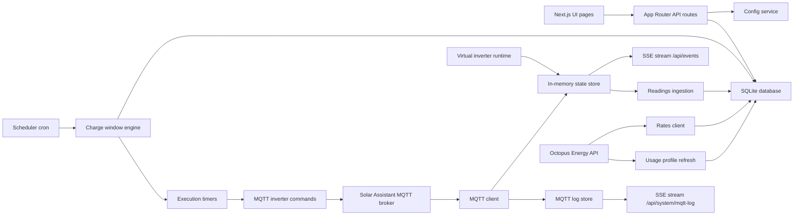

# Software Architecture

SolarBuddy is a self-hosted Next.js application that combines a server-rendered dashboard with long-lived background services. It monitors inverter telemetry from Solar Assistant over MQTT, fetches Octopus Agile tariff and consumption data over HTTP, computes slot-level battery actions plus derived execution windows, and persists operational data in SQLite.

SolarBuddy also supports an optional Virtual Inverter runtime that swaps the live MQTT-backed inverter for a scripted in-memory scenario. When enabled, the UI, scheduler, and simulator all read from the virtual runtime while outbound inverter commands are intercepted and simulated instead of being published to MQTT.

## Runtime Overview

## Deployment Model

- The app runs as a Node.js Next.js server. Background services are only started when `NEXT_RUNTIME === 'nodejs'`.
- Production container builds use Next.js standalone output so the runtime image stays small and deployment remains platform-neutral.
- [`src/instrumentation.ts`](../src/instrumentation.ts) is the server startup hook. It starts four long-lived services:
  - MQTT connectivity via [`src/lib/mqtt/client.ts`](../src/lib/mqtt/client.ts)
  - Scheduler cron jobs via [`src/lib/scheduler/cron.ts`](../src/lib/scheduler/cron.ts)
  - Inverter state reconciliation via [`src/lib/scheduler/watchdog.ts`](../src/lib/scheduler/watchdog.ts)
  - Telemetry snapshot ingestion via [`src/lib/readings/ingest.ts`](../src/lib/readings/ingest.ts)
- SQLite is opened lazily through [`src/lib/db.ts`](../src/lib/db.ts). The module is also responsible for schema creation and lightweight additive migrations.
- [`src/lib/virtual-inverter/runtime.ts`](../src/lib/virtual-inverter/runtime.ts) owns the optional sandbox runtime, virtual clock, preset scenario playback, and mode-aware schedule/rate sources.

## Architectural Style

- UI and HTTP entry points are thin Next.js pages and route handlers under `src/app/`.
- Business logic lives in focused modules under `src/lib/`.
- Cross-request runtime state is held in process memory and shared through `globalThis` singletons for:
  - the live inverter state store in [`src/lib/state.ts`](../src/lib/state.ts)
  - the MQTT client in [`src/lib/mqtt/client.ts`](../src/lib/mqtt/client.ts)
  - the MQTT live log query helpers in `src/lib/mqtt/logs.ts`
  - the virtual inverter runtime in [`src/lib/virtual-inverter/runtime.ts`](../src/lib/virtual-inverter/runtime.ts)
- Durable state is stored in SQLite, which acts as the operational system of record for settings, tariff data, telemetry history, slot plans, schedules, and overrides.

## Main Subsystems

### 1. Presentation Layer

- App Router pages under `src/app/` render the dashboard, analytics, settings, schedule, inverter, solar, activity, and system views.
- UI components live under `src/components/` and are grouped by feature area.
- Real-time UI updates consume the server-sent events stream exposed by [`src/app/api/events/route.ts`](../src/app/api/events/route.ts).
- The browser caches the last live inverter snapshot in local storage and restores it on reload when the current SSE state is still empty. A shared app-level status banner explains when the UI is showing cached telemetry or still waiting for first MQTT data.

### 2. Configuration and Persistence

- [`src/lib/config.ts`](../src/lib/config.ts) defines the application settings contract and default values.
- Settings are stored as string key-value pairs in the `settings` table and surfaced through `/api/settings`.
- [`src/lib/db.ts`](../src/lib/db.ts) enables WAL mode, turns on foreign keys, creates tables, and applies additive schema migration for new telemetry columns.

### 3. Telemetry Ingestion

- The MQTT client subscribes to Solar Assistant topics and normalizes payloads into the in-memory inverter state store.
- When Virtual Inverter mode is enabled, the virtual runtime becomes the active producer for the shared state store and emits scripted telemetry snapshots on its own timer instead of subscribing to MQTT.
- MQTT connection lifecycle events, inbound topic payloads, and outbound command publishes are written into a bounded SQLite-backed log for the System Logs UI.
- [`src/lib/state.ts`](../src/lib/state.ts) emits change events whenever new telemetry arrives.
- [`src/lib/readings/ingest.ts`](../src/lib/readings/ingest.ts) snapshots the latest live state into SQLite once per minute, but only while MQTT is connected so stale values are not recorded.
- Operator-facing activity entries are written through [`src/lib/events.ts`](../src/lib/events.ts). The activity and system-log event views read from this shared module so scheduler decisions and MQTT lifecycle changes appear consistently across both pages.

### 4. Tariff Fetching and Scheduling

- [`src/lib/octopus/rates.ts`](../src/lib/octopus/rates.ts) fetches Agile tariff data from the Octopus Energy REST API and upserts it into `rates`.
- In Virtual Inverter mode, rate, export-rate, forecast, and plan data are served from the active scenario fixture rather than from SQLite-backed live integrations.
- [`src/lib/scheduler/cron.ts`](../src/lib/scheduler/cron.ts) runs the scheduling cycle during the afternoon and evening publication window for Agile rates.
- [`src/lib/scheduler/engine.ts`](../src/lib/scheduler/engine.ts) supports two operator-selectable planning strategies:
  - `night_fill`: filters rates into the configured overnight window, estimates how many half-hour slots are needed to reach the target SOC from the current SOC, and picks the cheapest eligible slots up to the configured max-slot cap.
  - `opportunistic_topup`: considers the current and future slots in the currently published Agile tariff horizon and picks the cheapest eligible slots needed to top the battery up without being restricted to the overnight window.
- A positive price threshold acts as a hard eligibility ceiling for either strategy.
- When `smart_discharge` is enabled, the planner simulates SOC across the published tariff horizon and can pair later discharge windows with earlier cheap charge slots, bounded by the configured reserve SOC floor, charge-slot budget, and optional discharge price threshold.
- In `opportunistic_topup` mode with `smart_discharge` enabled, the base charge-slot selector now applies a load-aware cap derived from expected demand in high-value discharge slots, while still honoring `min_soc_target`.
- The scheduler emits a canonical `plan_slots` timeline with exactly one action per future half-hour slot: `charge`, `discharge`, or `hold`. These are the only three actions SolarBuddy can take — nothing else. Any slot that is not explicitly a charge or discharge slot is persisted as `hold`.
- `hold` means the planner is intentionally preserving the battery in that slot. In some cases that is because it is saving energy for a better future discharge opportunity; in others it is simply preventing discharge while waiting. Physically, the watchdog implements `hold` by setting the inverter to Load first and pinning `load_first_stop_discharge` to the current SOC, so home load comes from grid and only PV surplus can continue to charge the battery.
- Adjacent `charge` and `discharge` actions are merged into execution windows before they are written to `schedules`.

### Usage Profile Learning

- [`src/lib/usage/compute.ts`](../src/lib/usage/compute.ts) refreshes the learned half-hour consumption profile daily.
- When `usage_source` is `octopus`, usage refresh first attempts to load meter consumption from [`src/lib/octopus/consumption.ts`](../src/lib/octopus/consumption.ts) using the configured API key, MPAN, and meter serial.
- If Octopus consumption is unavailable, insufficient, or errors, the refresh automatically falls back to local `readings.load_power` samples.
- The computed profile is persisted to `usage_profile` and `usage_profile_meta`, and read by scheduler forecasting helpers in [`src/lib/usage/repository.ts`](../src/lib/usage/repository.ts).

### 5. Charge Execution

- [`src/lib/scheduler/executor.ts`](../src/lib/scheduler/executor.ts) translates planned windows into `setTimeout` timers.
- A mode-aware command boundary under `src/lib/inverter/commands.ts` routes executor/watchdog actions either to live MQTT commands or to the virtual command adapter.
- At window start, SolarBuddy activates the planned window and evaluates live telemetry before forcing grid charge.
- Discharge windows use the inverter's forced discharge mode for their full duration and are persisted in SQLite with `type = 'discharge'`.
- When SolarBuddy transitions into discharge, it explicitly clears the battery charge slot first so inverter models without a reliable charge-enabled read-back cannot remain stuck charging.
- `night_fill` starts grid charging immediately once the window begins, unless the battery is already at or above target SOC.
- `opportunistic_topup` can defer or pause forced grid charging when live telemetry suggests solar surplus or export is already charging the battery naturally.
- During a charge window, the executor watches live state and can stop early once the configured minimum state of charge target is reached.
- At window end, the executor restores the configured default work mode and updates schedule execution status in SQLite. Matching `plan_slots` charge and discharge rows are updated alongside the derived schedule window.
- [`src/lib/scheduler/watchdog.ts`](../src/lib/scheduler/watchdog.ts) reconciles the desired inverter state against live telemetry and inverter read-back on startup, every 30 seconds, and after relevant MQTT-driven state changes when the `watchdog_enabled` setting is on.
- The watchdog derives current intent from the active manual override first and the active persisted `plan_slots` row second. Planned `hold` slots reconcile to an explicit battery-preserving inverter state (Load first + stop-discharge pinned to current SOC), while planned charge slots still apply the same minimum-SOC and opportunistic-top-up solar-surplus checks as the executor. If those checks fire, the charge slot falls back to the same `hold` behaviour rather than an implicit idle state — SolarBuddy always resolves to charge, discharge, or hold.
- When no plan slot is active for the current moment (e.g. startup before the first plan is written, or a transient gap), the watchdog treats that as `hold` at the current SOC rather than returning the inverter to its default self-consumption mode. This is the explicit, user-chosen behaviour and means home load always comes from grid during any gap in the plan.
- If an inverter keeps charging without publishing the charge-enabled read-back flag, the watchdog now falls back to live power telemetry to detect and clear that lingering grid-charge state before applying the planned action.
- Disabling the watchdog only stops the background reconciliation loop. Explicit operator actions, such as writing an override for the current slot, can still trigger a one-off reconciliation pass.
- That reconciliation loop closes the gap left by one-shot timers: it lets current-slot overrides actuate immediately, restores active windows after a process restart, and retries toward the desired state if the inverter drifts or a command does not stick.

## Key Data Flows

### Live Telemetry Flow

1. Solar Assistant publishes MQTT topic updates.
2. The MQTT client parses topic names and values.
3. The in-memory state store is updated and notifies listeners.
4. Recent MQTT activity is written into the MQTT log store and streamed through `/api/system/mqtt-log`.
5. `/api/events` streams the latest state to connected browser clients.
6. The periodic ingestion service snapshots the live state into `readings`.
7. Browser clients persist the most recent non-empty telemetry snapshot locally so transient reloads do not blank the UI before the next MQTT update arrives.
8. The watchdog queues reconciliation after relevant telemetry changes so the inverter is nudged back toward the active schedule or override if it drifts.

When the virtual runtime is active, the same shared state store and SSE stream are used, but the producer is the scripted scenario ticker. The UI does not need a separate live-data path for sandbox mode.

### Daily Scheduling Flow

1. The cron service triggers `runScheduleCycle()`.
2. SolarBuddy fetches the next relevant Agile rate window from Octopus Energy.
3. The scheduler engine derives eligible half-hour slots from operator settings and emits a slot-by-slot battery plan.
4. Canonical slot actions are written to `plan_slots`, and derived charge/discharge windows are written to `schedules`.
5. If auto-scheduling is enabled, execution timers are created from the derived windows.

### Usage Learning Flow

1. The daily usage-refresh cron job triggers `computeUsageProfile()`.
2. SolarBuddy loads usage samples from the configured source (Octopus first or telemetry-only).
3. Samples are bucketed into weekday/weekend half-hour slots with baseload and high-period detection.
4. The new profile is persisted to `usage_profile` and `usage_profile_meta`.
5. If the profile changed materially, SolarBuddy queues a scheduler replan.

### Operator Interaction Flow

1. The browser calls App Router API endpoints for settings, schedules, overrides, analytics, and system status.
2. Route handlers validate request payloads at the boundary and delegate to focused services or direct SQLite queries.
3. The schedule and rates views normalize persisted UTC slot timestamps before matching `plan_slots`, `schedules`, and overrides back onto half-hour rate rows, and the Charge Plan view groups those rows into UK-local day slices so operators can navigate today and recent history without reading one long mixed timeline.
4. Updating `/api/overrides` persists the operator’s slot choice and immediately triggers a reconciliation pass, so current-slot overrides can actuate the inverter without waiting for a future scheduler timer.
5. The UI renders a mix of persisted history and live SSE state.

When Virtual Inverter mode is enabled, mode-aware API handlers serve virtual rates, forecasts, schedules, and status directly from the in-memory sandbox runtime while keeping the JSON response shapes compatible with the live mode.

## Persistence Model

The SQLite schema currently contains:

- `settings`: application configuration values
- `rates`: cached Octopus Agile tariff data
- `plan_slots`: canonical slot-level planner output and execution metadata
- `schedules`: planned and executed charge windows
- `readings`: periodic inverter telemetry snapshots
- `usage_profile`: learned weekday/weekend half-hour consumption buckets
- `usage_profile_meta`: profile baseload, learning window, and high-period metadata
- `events`: operational event history
- `mqtt_logs`: recent MQTT connection, topic, and command activity
- `carbon_intensity`: cached grid carbon intensity records
- `manual_overrides`: manually selected charge slots for the current day

When the `events` table is empty on an existing install, SolarBuddy derives a temporary event feed from recent scheduler rows and MQTT system log entries so the Activity page still shows meaningful recent operations until dedicated event entries are recorded.

The default database path is `data/solarbuddy.db`, unless `DB_PATH` is set.

## Operational Constraints

- Scheduler time calculations are normalized to `Europe/London` in the charge window engine.
- The in-memory state store and timer-based executor are process-local. If SolarBuddy is ever run as multiple Node processes, live telemetry state and scheduled timers would not be coordinated across instances.
- The virtual inverter runtime is also process-local and global to the instance. It is not scoped per browser session.
- The supported deployment topology is a single app replica with persistent SQLite storage mounted into the container or host runtime.
- Recent MQTT log history is persisted in SQLite and trimmed to a bounded recent window for the live logs view.
- Cron scheduling assumes Octopus Agile rates become available during the configured afternoon and evening retry window.
- The Charge Plan UI now presents the stored schedule horizon as separate UK-local days. Past days are treated as read-only history, while today and future days continue to accept overrides against the stored horizon.

## Directory Guide

- `src/app/`: page routes and API handlers
- `src/components/`: feature-oriented UI components
- `src/hooks/`: React hooks for SSE, theme, and selection behavior
- `src/lib/config.ts`: settings model and persistence
- `src/lib/db.ts`: SQLite connection and schema
- `src/lib/mqtt/`: MQTT topics, commands, and client lifecycle
- `src/lib/octopus/`: Octopus Energy integration
- `src/lib/usage/`: usage learning, profile persistence, and forecast lookups
- `src/lib/readings/`: telemetry persistence jobs
- `src/lib/scheduler/`: schedule computation, cron orchestration, and execution

## Extension Guidance

- Keep API handlers thin and move new behavior into `src/lib/` modules.
- Prefer additive schema changes with migration logic in [`src/lib/db.ts`](../src/lib/db.ts).
- Any change to scheduling rules, data shape, or operator flows should update this document and the relevant API or development docs in the same change.
- The supported runtime model remains a single active process per deployment. Record any architectural change to that assumption in [`decisions/`](decisions/README.md) before implementation.
